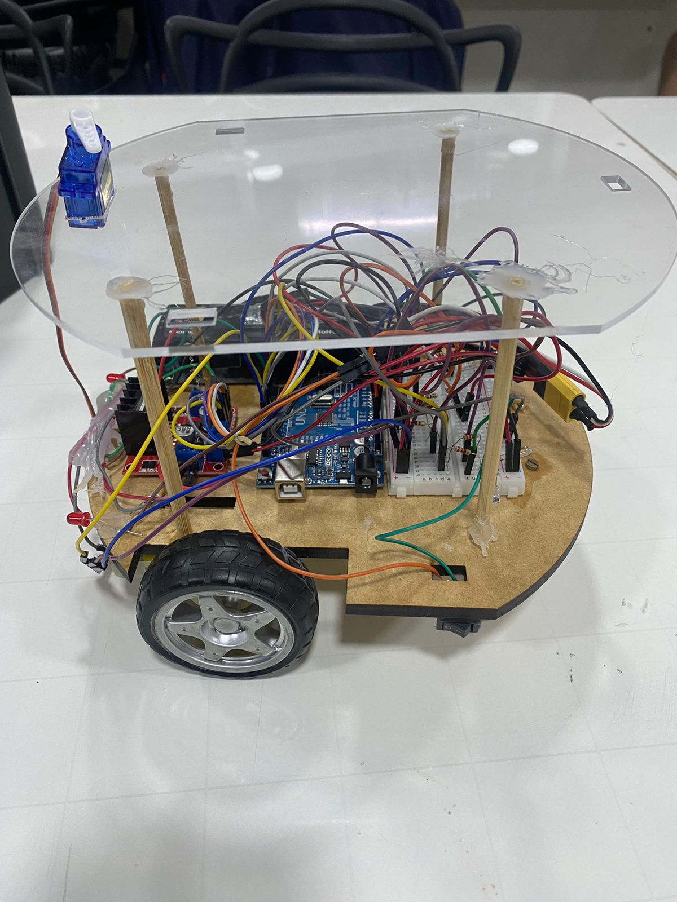

# Carrinho Arduino Controlado por Bluetooth

## Descrição

Este projeto consiste em um carrinho controlado via Bluetooth, utilizando Arduino, baterias, sensores, led, pontes e motores. O carrinho pode ser movimentado remotamente por um aplicativo (ou controle) que envia comandos para o Arduino.

---

## Funcionalidades

- Controle do movimento do carrinho (frente, trás, esquerda, direita);
- Comunicação via módulo Bluetooth;
- Alimentação por baterias recarregáveis;
- Fácil de usar

---

## Tecnologias Utilizadas

- Arduino IDE
- Módulo Bluetooth HC-05 (ou similar)
- Motores DC
- Driver de motor (ex: L298N)
- Programação em C++

---
## Foto

<div align="center">
  
</div>


---
## Como usar

1. Clone o repositório:
   ```bash
   git clone https://github.com/Wani-Brito/carrinho-arduino.git
